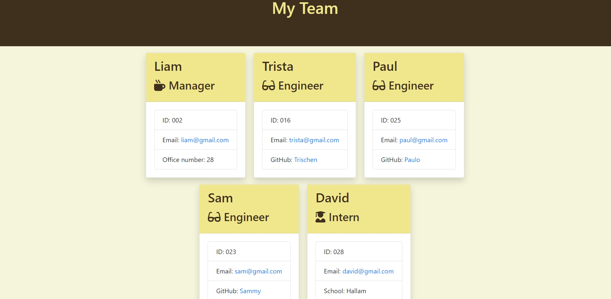

# Team-Profile-Generator

## Description
Team profile generator is a tool that allows users to easily create professional-looking profiles for their team members. This tool can be used by organizations of all sizes, from small startups to large corporations.
The team profile generator can help organizations to create a more professional and organized appearance, showcase the skills and expertise of their team members, and make it easier for clients and collaborators to connect with the right people.

## Table of Contents

* [Installation](#install)
* [Usage](#usage)
* [Tech/framework used](#techframework-used)
* [Screenshot](#screenshot)
* [Contributing](#contributing)
* [Tests](#tests)
* [Questions](#questions)
* [Credits](#credits)
* [License](#license)

## Install
 To install: 
 * Download or clone the repository 
 * Install the package by running `npm install <package-name>` in the terminal 
 * Ensure to have the latest version of Node.js and npm (Node Package Manager) installed on your machine.

 ## Tech/framework used

Project is created using:
<ul>
    <li>Javascript</li>
    <li>Node.js</li>
    <li>Inquirer.js</li>
    <li>Jest</li>
</ul>

## Usage
* Install the team profile generator: Depending on the tool, you may need to install the generator onto your computer or access it through a website.
* Run the team profile generator: Once the generator is installed, you can run it by executing a command in your terminal or by visiting a website. 
* Provide information about your team member
* Generate the team.html file
* Review and edit the team.html file
* Save the team.html file

## Screenshot

## Contributing
* Reporting issues: If you find a bug or have a feature request, you can open an issue on the project's GitHub page. This allows the maintainers of the project to track and address the problem.
* Forking the repository: You can create a copy of the project's repository in your own GitHub account. This allows you to make changes to the code and submit them back to the original repository through a pull request.
* Submitting pull requests: After making changes to the code in your forked repository, you can submit a pull request to the original repository. A pull request is a request for the maintainers of the project to review and merge your changes into the main codebase.
* Reviewing pull requests: If you are a maintainer of a project, you can review and merge pull requests submitted by other users.
* Providing feedback: You can provide feedback on issues, pull requests, and other contributions to the project through comments.

## Tests
You can clone the project's repository to your local machine and run the tests with command line using your favourite terminal. This requires that you have the necessary dependencies and testing tools installed on your machine.

## Questions
Feel free to contact at oluyomisamuels@gmail.com to ask any questions about this project. To view other projects by me; please visit https://github.com/hollusam

## Credits

<li>Philip Howley (My Instructor)</li>

<li>Nic Catania (My personal TA)

<li>All the TAs of Triology Bootcamp

## License

N/A